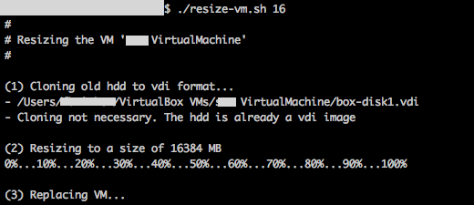

# resize-vagrant-vm
A script to expand / resize vagrant virtual machines

### Usage
You may have to edit the **VM_NAME** variable at the beginning of the script. It's set to read the name from a *config.yaml* file, but you can change it to your-vms-name in Virtual Box, e.g. `VM_NAME="My Development VM"`

Call `./resize-vm.sh *X*` in your directory with the Vagrantfile.
Replace `*X*` with a number for the dedicated size. To resize your VM to 20GB, execute `./resize-vm.sh 20`

### How does it work?
The Script detects your hdd image for the machine, clones it, if necessary, into the .vdi format, resizes it and mounts it back. Afterwards, the old vmdk file is not needed anymore and gets deleted. If you want to resize it again, it resizes the new vdi file.

### Limitations
You have to use VirtualBox as provider.

### Future
A vagrant plugin would be great, but at the moment i don't have the time to learn working with Ruby Gems.. :)
